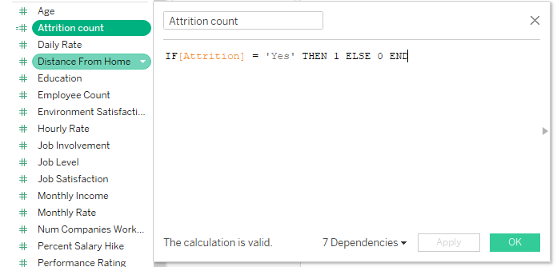
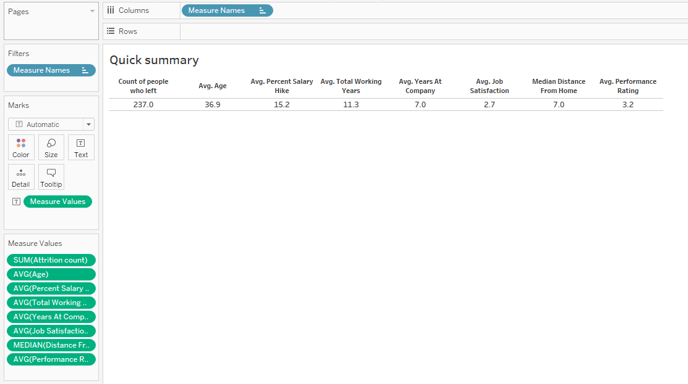
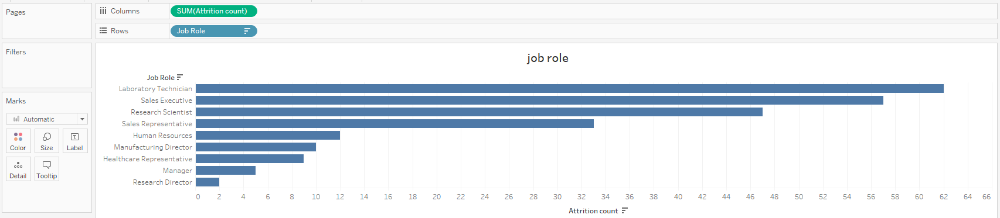
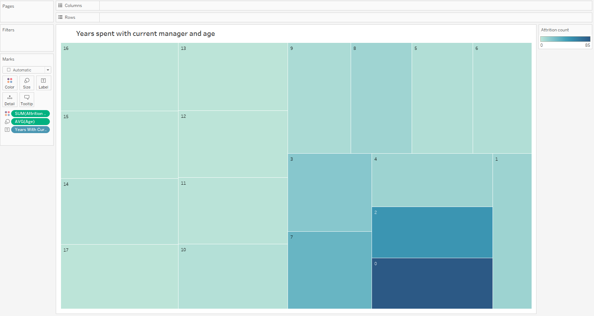
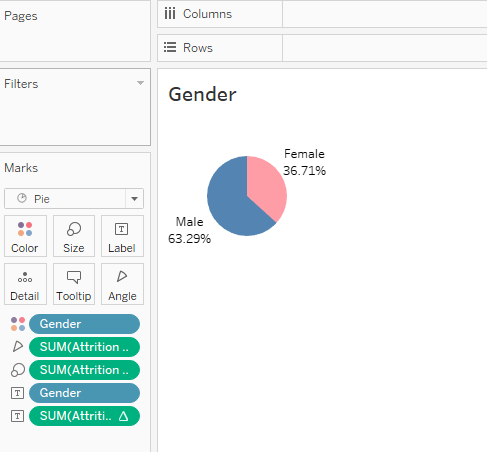
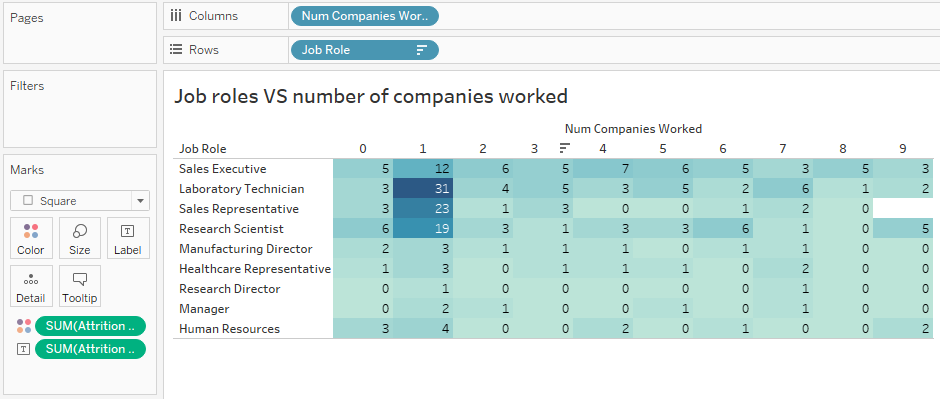

# An analysis of people who quit their jobs.

This case study is done in Tableau to identify the primary factors causing attrition.

## Objectives

- Analyse a data set on the human resources of a company called ‘149 Solutions’(hypothetical). 
- Create appropriate visualisations to identify the factors causing people to quit their jobs. 
- Prepare a dashboard containing these visualisations by applying the best practices.

## Guided by
Subject Matter Expert :
[Amit Goyal](https://www.linkedin.com/in/amit-goyal-09067467/)

Team Lead - Data Analytics, Paytm

## Data
[Human+Resource+Data.csv](Human+Resource+Data.csv) contains information of 470 employees.
This data is used for the analysis.

## Procedure

### Load the data and create a new attribute
<kbd>    </kbd>
<kbd>    </kbd>

### Quick summary 
quick summary contains the information about:
Number of people who left the company, Average age of the employees, Average salary hike percentage, Average total working years, Median distance from home, Avetage performance rating.
<kbd>    </kbd>

### Factors of Attrition

Factors are:

- Job role:
  - Most of the employees who left the company were laboratory technicians and sales executives.
<kbd>    </kbd>

- Years with the current manager: 
  - Most of the employees who left the company had reported to their current manager for less than a year.
<kbd>    </kbd>

- Number of companies: 
  - Employees who worked in only one company before working at 149 Solutions contributed the highest to the attrition rate.
<kbd>    </kbd>

- Gender: 
  - A large number of male employees left the company as compared with female employees.
<kbd>    </kbd>

- Job role and number of companies: 
  - Laboratory technicians who worked in only one company before 149 solutions contributed the most to the attrition rate.
<kbd>    </kbd>
