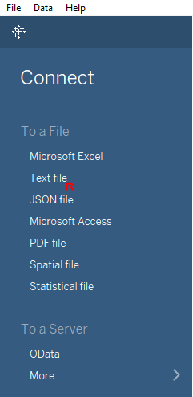
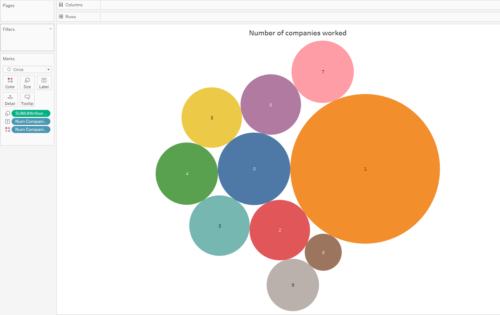

# An analysis of people who quit their jobs.

This case study is done in Tableau to identify the primary factors causing attrition.

Check out the [Dashboard](https://public.tableau.com/views/Ananalysisofpeoplewhoquittheirjobs/Dashboard1?:language=en-US&:display_count=n&:origin=viz_share_link) containing the analysis.

<noscript></noscript><object class='tableauViz'  style='display:none;'><param name='host_url' value='https%3A%2F%2Fpublic.tableau.com%2F' /> <param name='embed_code_version' value='3' /> <param name='site_root' value='' /><param name='name' value='Ananalysisofpeoplewhoquittheirjobs&#47;Dashboard1' /><param name='tabs' value='no' /><param name='toolbar' value='yes' /><param name='static_image' value='https:&#47;&#47;public.tableau.com&#47;static&#47;images&#47;An&#47;Ananalysisofpeoplewhoquittheirjobs&#47;Dashboard1&#47;1.png' /> <param name='animate_transition' value='yes' /><param name='display_static_image' value='yes' /><param name='display_spinner' value='yes' /><param name='display_overlay' value='yes' /><param name='display_count' value='yes' /><param name='language' value='en-US' /></object>
    

[click to interact](https://public.tableau.com/views/Ananalysisofpeoplewhoquittheirjobs/Dashboard1?:language=en-US&:display_count=n&:origin=viz_share_link)

## Objectives

- Analyse a data set on the human resources of a company called ‘149 Solutions’(hypothetical company). 
- Create appropriate visualisations to identify the factors causing people to quit their jobs. 
- Prepare a dashboard containing these visualisations by applying the best practices.

## Guided by
Subject Matter Expert :
[Amit Goyal](https://www.linkedin.com/in/amit-goyal-09067467/)

Team Lead - Data Analytics, Paytm

## Data
[Human+Resource+Data.csv](Human+Resource+Data.csv) contains information of 470 employees.
This data is used for the analysis.

## Procedure

### Load the data and create a new attribute
<kbd>    </kbd>
<kbd>    </kbd>

### Quick summary 
Quick summary contains the information about:
Number of people who left the company, Average age of the employees, Average salary hike percentage, Average total working years, Median distance from home, Avetage performance rating.
<kbd>    </kbd>

### Factors of Attrition

Factors are:

- Job role:
  - Most of the employees who left the company were laboratory technicians and sales executives.
<kbd>    </kbd>

- Years with the current manager: 
  - Most of the employees who left the company had reported to their current manager for less than a year.
<kbd>    </kbd>

- Number of companies: 
  - Employees who worked in only one company before working at 149 Solutions contributed the highest to the attrition rate.
<kbd>    </kbd>

- Gender: 
  - A large number of male employees left the company as compared with female employees.
  - Among females, 14.7% quit their jobs, while 17.0% quit theirs.
  
<kbd>    </kbd>

- Job role and number of companies: 
  - Laboratory technicians who worked in only one company before 149 solutions contributed the most to the quitting rate.
  - There were fewer quitters among those who worked at eight or nine different jobs
<kbd>    </kbd>

## Dashboard [click to interact](https://public.tableau.com/views/Ananalysisofpeoplewhoquittheirjobs/Dashboard1?:language=en-US&:display_count=n&:origin=viz_share_link)

<noscript></noscript><object class='tableauViz'  style='display:none;'><param name='host_url' value='https%3A%2F%2Fpublic.tableau.com%2F' /> <param name='embed_code_version' value='3' /> <param name='site_root' value='' /><param name='name' value='Ananalysisofpeoplewhoquittheirjobs&#47;Dashboard1' /><param name='tabs' value='no' /><param name='toolbar' value='yes' /><param name='static_image' value='https:&#47;&#47;public.tableau.com&#47;static&#47;images&#47;An&#47;Ananalysisofpeoplewhoquittheirjobs&#47;Dashboard1&#47;1.png' /> <param name='animate_transition' value='yes' /><param name='display_static_image' value='yes' /><param name='display_spinner' value='yes' /><param name='display_overlay' value='yes' /><param name='display_count' value='yes' /><param name='language' value='en-US' /></object>
                
